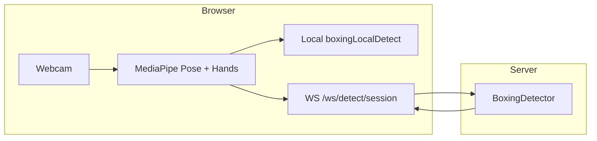
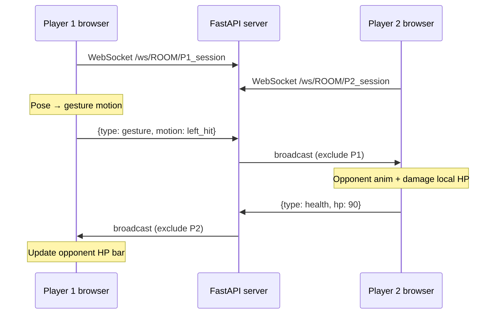

# BOX-ing — Architecture Overview (Presentation Notes)

This document explains how the app runs end-to-end: authentication, multiplayer rooms, the camera test, and real-time networking. Use it to prepare a demo or technical presentation.

---

## 1. Tech stack (high level)

| Layer | Technology |
|--------|------------|
| **Frontend** | React (Vite), React Router, Tailwind-style inline/CSS classes, Framer Motion, **Three.js** + **React Three Fiber** + **Drei** for 3D fighters |
| **Pose / hands** | **MediaPipe Tasks Vision** (`@mediapipe/tasks-vision`) — Pose Landmarker (full model, GPU delegate) in the browser |
| **Backend** | **FastAPI** (Python), **Uvicorn**, **WebSockets** (Starlette/FastAPI) |
| **Auth** | **JWT** (python-jose), passwords hashed with **Argon2** (passlib) |
| **Data** | **MongoDB Atlas** (users, sessions, rooms, matchmaking queue, leaderboard) |
| **API config** | `frontend/src/config/api.js` — `VITE_API_URL` / `VITE_WS_URL` for production; local dev 

defaults to `http(s)://<host>:8000` |

### Why these choices (talking points)

- **FastAPI** — very fast to build typed REST + WebSocket APIs in one service; strong Pydantic validation; clean async support for real-time flows.
- **OAuth2 password flow + JWT Bearer** — standard approach for SPA + API authentication; easy to call from frontend using `Authorization` headers; stateless auth at request time.
- **Argon2 password hashing** — modern memory-hard hashing for safer password storage than basic hash methods.
 **Hooks** — Hooks let us add behavior to function components without classes
- **CORS middleware** — required because frontend and backend run on different origins in dev/prod. Implemented with:
  - `allow_origins=["*"]`
  - `allow_credentials=False`
  - `allow_methods=["*"]`
  - `allow_headers=["*"]`
  This works because auth uses Bearer headers (not cross-site cookies).
- **MongoDB Atlas** — document model fits flexible session/room/matchmaking payloads and quick iteration.
- **WebSockets** — needed for low-latency two-player sync (gesture and HP events) without polling every frame.
- **MediaPipe in browser** — keeps pose inference close to the camera feed (low latency), reducing server load and bandwidth.

---

## 2. Login and signup

### Flow

1. After the intro, `App.jsx` checks `localStorage.getItem('access_token')`. If there is no token and the route is not `/auth`, the user is redirected to **`/auth`**.
2. **`AuthPage.jsx`** toggles between **Sign In** and **Create Account**.
3. On submit it **POST**s JSON to the backend:
   - Login: `POST /auth/login` with `{ email, password }`
   - Signup: `POST /auth/signup` with `{ email, password, display_name }`
4. **`backend/auth_routes.py`**
   - **Signup**: rejects duplicate email (409). Creates user in MongoDB, hashes password, returns JWT.
   - **Login**: looks up user, verifies password, returns JWT.
5. The frontend stores **`access_token`** in **`localStorage`** and navigates to **`/`** (landing).
6. Subsequent **HTTP** calls that need identity send  
   `Authorization: Bearer <access_token>`.

### Token usage

- **`OAuth2PasswordBearer`** (`/auth/login` as token URL) is used for dependencies like `get_current_user` (required) and `get_current_user_optional` (guest-friendly flows).
- **`/me`** returns the current user (requires valid token).
- Session endpoints like `POST /session/start` use **`get_current_user_optional`**: logged-in users get `user_id` and display name from the account; guests can still play with limited features.

### Security notes (talking points)

- CORS uses `allow_origins=["*"]` with **`allow_credentials=False`**; auth is **Bearer tokens in headers**, not cross-site cookies.
- JWT payload includes subject (`sub` = user id), issued-at, expiry (`auth/auth.py`).

---

## 3. Sessions (why every mode gets a `session_id`)

**`POST /session/start`** (`main.py`) creates a **session document** in MongoDB (`sessions_col`):

- Unique **`id`** (hex UUID) — this is the **`session_id`** the client keeps for that play session.
- **`user_id`** if authenticated.
- **`player_name`**, **`mode`** (`solo` / `multiplayer`), **`room_code`** (if any), matchmaking flags, **`points`**, timestamps.

The same session id is also mirrored in an in-memory dict **`SESSIONS`** for the **pose-detection WebSocket** (see §6).

---

## 4. Multiplayer: two ways to get into a match

### A) Matchmaking (`/multiplayer`)

1. **`POST /session/start`** with `{ mode: "multiplayer", is_matchmaking: true }` → new `session_id` + session row.
2. **`POST /matchmaking/join?session_id=...`**  
   - Server **atomically** tries to pair this session with another waiting session (MongoDB `matchmaking_col`).
   - If a partner exists: both sessions get the same **`room_code`** (6 digits), **`is_matched`**, opponent names; a **room** document is upserted in **`rooms_col`** with both users.
   - If not: returns **`searching`**; client polls **`GET /matchmaking/status/{session_id}`** until **`matched`**.
3. UI then navigates to **`/multiplayer-arena`** with **React Router `state`**:  
   `roomCode`, `playerName`, `opponentName`, `sessionId`.

### B) Private room — Create / Join (`/create-room`)

1. **Host — Create**  
   - **`POST /session/start`** with `{ mode: "multiplayer" }` and **Bearer token**.  
   - For `multiplayer` without an existing `room_code`, the API **generates a 6-digit `room_code`** and adds the user to **`rooms_col`** via `$addToSet` on `users`.
2. **Guest — Join**  
   - **`GET /room/{room_code}/status`** — must not be full (`users.length < 2`).
   - **`POST /session/start`** with `{ mode: "multiplayer", room_code: "<code>" }` — second player joins the same room list.
3. The UI **polls** **`GET /room/{room_code}/status`** every ~2s until **`status === "ready"`** (two players).
4. Navigate to **`/multiplayer-arena`** with the same **`state`** shape as matchmaking (room code, names, `sessionId`).

---

## 5. In-game real-time: how two players connect

### WebSocket URL

```
ws(s)://<API host>/ws/{room_code}/{session_id}
```

Defined in **`main.py`** → **`websocket_endpoint`**.

### Connection manager

- **`ConnectionManager`** keeps **`active_connections[room_code]`** = list of WebSocket connections for that room.
- **`connect`**: `accept()`, append socket to the room list.
- **`disconnect`**: remove socket; optionally broadcast **`{ "type": "disconnect", "session_id" }`**.

### Message rule (important)

When a client sends a JSON message, the server:

1. Injects **`session_id`** from the URL (so payloads always identify the sender).
2. **Broadcasts the message to every other socket in the same `room_code`** — **not** back to the sender (`exclude_websocket`).

So: **each player only receives messages from the other player** (plus disconnect notifications).

---

## 6. What is sent and received in the arena (`MultiplayerArena.jsx`)

### Local side (your machine)

1. **Webcam** → **`usePoseDetection`** (MediaPipe Pose Landmarker) → **`poseData.points`** each frame.
2. **`detectLocalMotion`** (`boxingLocalDetect.js`) maps landmarks to a motion: **`idle` | `block` | `left_hit` | `right_hit`** (client-side thresholds).
3. When motion **changes** to non-idle and a short throttle (~380 ms) allows, the client sends:

```json
{ "type": "gesture", "motion": "left_hit" }
```

(or `right_hit`, `block`, etc.)

4. On connect, the client sends **`{ "type": "health", "hp": 100 }`** so the peer can sync HP.

### Remote side (opponent’s messages you receive)

Handler **`handleRoomMessage`** (parse JSON):

| Message | Effect |
|---------|--------|
| **`type: "gesture"`** | If `session_id` ≠ yours: play **opponent** ninja animation (`left_hit` / `right_hit` / `block`). If it’s a **hit**, reduce **your** HP and send back **`{ type: "health", hp: <newHp> }`**. |
| **`type: "health"`** | Updates **opponent’s** HP bar (what they have left from their perspective — used to keep bars in sync). |
| **`type: "disconnect"`** | Ignored for gameplay (could be extended). |

### Exactly where hit and block are registered (code-level map)

#### Hit registration

1. **Detection source (attacker side):**  
   `frontend/src/utils/boxingLocalDetect.js` inside `analyzeLocalPose(...)` sets:
   - `motion = "left_hit"` or `motion = "right_hit"` when hit gates pass (elbow angle, extend, speed, depth/shoulder geometry).
2. **Send gesture (attacker side):**  
   `frontend/src/pages/MultiplayerArena.jsx` (pose `useEffect`) calls `detectLocalMotion(...)` and sends:
   - `{ type: "gesture", motion: "left_hit" }` or `{ ... "right_hit" }`
3. **Apply damage (defender side):**  
   `handleRoomMessage(...)` in `MultiplayerArena.jsx`:
   - reads incoming `type: "gesture"` hit
   - if not blocked, runs `setMyHp(prev => prev - DAMAGE_PER_HIT)`
   - then sends `{ type: "health", hp: newHp }` back to sync bars.

#### Block registration

1. **Detection source (defender side):**  
   `boxingLocalDetect.js` marks `motion = "block"` when both wrists stay near face for `blockConfirmFrames`.
2. **Local anti-flicker filter (defender side):**  
   `MultiplayerArena.jsx` adds a short `BLOCK_TO_HIT_GRACE_MS` window:
   - if a hit is detected immediately after block, it is treated as `block` to avoid block→hit jitter.
3. **Block resolution on incoming hit:**  
   In `handleRoomMessage(...)`, the defender checks:
   - `localMotionRef.current === "block"` OR
   - recent block in `wasBlockingInWindow(..., BLOCK_ABSORB_WINDOW_MS)`
4. **If blocked:**  
   no HP loss is applied; optional `{ type: "hit_absorbed", absorbed: "block" }` is sent to attacker.

### Win / leaderboard

- When **`opponentHp`** hits 0 → local **win**; **`myHp`** 0 → **lose**.
- On win, optional **`POST /multiplayer/record-win`** with Bearer token increments **`multiplayer_wins`** on the leaderboard.

**Note:** Game logic is **lightweight**: gesture events + HP sync over one WebSocket; there is no authoritative server-side fight simulation in this MVP.

---

## 7. Camera test (what it is and what it uses)

**Route:** `/camera-test` (`CameraTest.jsx`).

### Purpose

- Live **webcam** (mirrored with CSS `scaleX(-1)`).
- **MediaPipe Pose** via **`usePoseDetection`** + **Hand Landmarker** via **`useHandDetection`** (hands drawn on overlay canvas).
- **Local** gesture classification with **`analyzeLocalPose` / `detectLocalMotion`** (same math as arena for hits/block).
- **Optional server-side** classification: **`POST /session/start`** gets a `session_id`, then a **second WebSocket** to **`/ws/detect/{session_id}`** sends pose frames; **`BoxingDetector`** in **`backend/routes/detection.py`** returns **`hit` / `block` / `idle`** and can drive the ninja + action log.
- **Calibration sliders** adjust thresholds (elbow angle, extend, speed, block distance, etc.).

### Two pipelines (good for slides)



- **Left path:** instant feedback + debug JSON in the UI.
- **Right path:** Python detector (slightly different thresholds / landmark swap rules than JS — see comments in `detection.py` about mirroring).

---

## 8. Detection WebSocket (camera test / server-side pose)

**Endpoint:** **`/ws/detect/{session_id}`** (`detection.py`).

- Client sends JSON containing:
  - **`landmarks`** — pose points array
  - **`timestamp`**
  - **`hand_data`** (optional) — hand landmarks + handedness
- Server runs **`BoxingDetector.process(...)`** and replies with **`action`**, **`side`**, **`velocity`**, **`hand_status`**, **`points`**, **`total_points`**, etc.

This is **independent** from the **room** WebSocket (`/ws/{room_code}/{session_id}`).

---

## 9. Diagram: multiplayer data path



---

## 10. File map (quick reference)

| Concern | Main files |
|---------|------------|
| Auth UI | `frontend/src/pages/AuthPage.jsx` |
| Auth API | `backend/auth_routes.py`, `backend/auth/auth.py`, `backend/database/db_users.py` |
| App routes / gate | `frontend/src/App.jsx` |
| Session + room HTTP + room WS | `backend/main.py` |
| Matchmaking | `main.py` (`/matchmaking/*`) + MongoDB collections |
| Pose detection hook | `frontend/src/hooks/usePoseDetection.js` |
| Local boxing math | `frontend/src/utils/boxingLocalDetect.js` |
| Arena | `frontend/src/pages/MultiplayerArena.jsx` |
| Create / join room UI | `frontend/src/pages/CreateRoom.jsx` |
| Matchmaking UI | `frontend/src/pages/Multiplayer.jsx` |
| Camera test | `frontend/src/pages/CameraTest.jsx` |
| Server detector | `backend/routes/detection.py` |

---

## 11. Suggested presentation order

1. **Stack** — React + Three.js arena, MediaPipe in browser, FastAPI + MongoDB + JWT.
2. **Auth** — signup/login → JWT in `localStorage` → Bearer on API calls.
3. **Getting into a match** — matchmaking queue **or** private 6-digit room + polling until two players.
4. **In-game** — one WebSocket per player per room; **broadcast gestures and health**; local pose drives animations and outgoing events.
5. **Camera test** — same pose pipeline + optional server detector WebSocket + calibration.

---

*Generated from the BOX-ing repository structure. If behavior changes, verify against `main.py`, `AuthPage.jsx`, `MultiplayerArena.jsx`, and `CameraTest.jsx`.*
