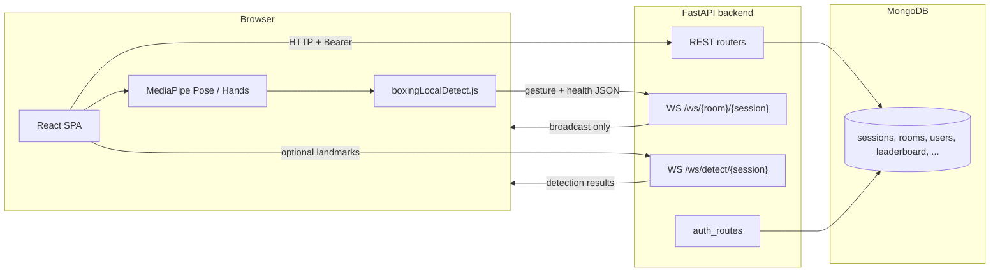

# Architecture overview

## High-level diagram

## Responsibilities

### Frontend

- Renders UI, 3D arena (`Three.js`), camera preview, audio.
- Runs **MediaPipe** for pose (and optionally hands) in Web Workers / WASM.
- Classifies **idle / left_hit / right_hit / block** locally using `boxingLocalDetect.js` for multiplayer and camera test flows.
- **Multiplayer**: opens WebSocket to `/ws/{room_code}/{session_id}` and sends JSON messages (gestures, HP updates, block absorb events). **No pose math on the server** for that path.

### Backend

- **REST**: sessions, rooms, matchmaking, leaderboard, auth, multiplayer win recording.
- **MongoDB**: persistent users, sessions, rooms, leaderboard, matchmaking queue.
- **In-memory `SESSIONS`** (`state.py`): used by the detection WebSocket to accumulate points for server-side detection sessions.
- **Room WebSocket**: pure **message relay** — each client’s JSON is broadcast to other peers in the same `room_code` (sender excluded). Server adds `session_id` to outgoing payloads.
- **Detection WebSocket** (`routes/detection.py`): optional **server-side** boxing classifier on raw landmarks; updates `SESSIONS` points and returns JSON actions.

### Dual database access

The codebase uses:

- **`db.py`** — synchronous **PyMongo** client for `main.py` (sessions, rooms, leaderboard, matchmaking).
- **`database/datab.py`** — **Motor** (async) client for auth user lookups and startup ping.

Both target the same MongoDB database name (`DB_NAME`, default `userdata`). This split is historical; new code should prefer one style unless there is a reason to keep both.

## CORS

CORS is configured with `allow_origins=["*"]` and `allow_credentials=False`. Authentication uses **Bearer tokens** in headers, not cookies, so wildcard origins remain valid.
