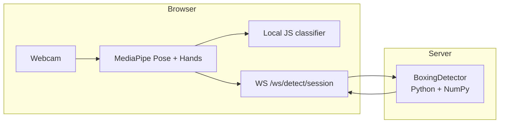
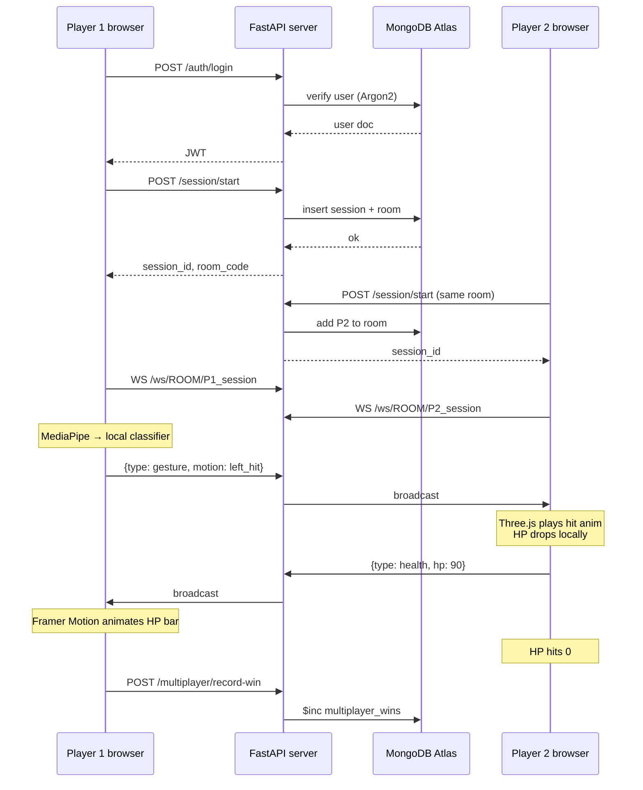

# BOX-ing — Tech Stack

A boxing game where **your body is the controller**. You throw real punches in front of your webcam, the browser tracks your pose, and your opponent — in another browser, anywhere — feels the hit in real time.

This document walks through every piece of technology in the stack, in the order data actually flows through it.

---

## The Stack at a Glance

| Layer | Technology |
|-------|------------|
| **Frontend framework** | React 19 + Vite + React Router |
| **3D rendering** | Three.js + React Three Fiber + Drei |
| **Animation & UI** | Framer Motion, Tailwind CSS, Lucide icons |
| **Computer vision (client)** | MediaPipe Tasks Vision — Pose Landmarker + Hand Landmarker (GPU) |
| **Backend API** | FastAPI (Python) + Uvicorn |
| **Real-time networking** | WebSockets (Starlette / FastAPI) |
| **Auth** | OAuth2 password flow + JWT (python-jose) + Argon2 password hashing (passlib) |
| **Database** | MongoDB Atlas (via Motor / PyMongo) |
| **Computer vision (server)** | MediaPipe Python + NumPy + OpenCV |
| **Validation** | Pydantic v2 |

---

## The Journey: From Click to Knockout

The best way to understand the stack is to follow a single user session from login to victory. Every piece of tech earns its spot because one step in the journey needs it.

---

### Step 1 — The user loads the page → **Vite + React 19**

When the browser hits the app, **Vite** serves the bundled frontend. Vite is our dev server and build tool: fast HMR in development, a lean production build for deploy.

**React 19** renders the UI as function components. We rely heavily on hooks:

- `useState` → holds gameplay state (HP, motion, match status)
- `useEffect` → wires up side effects (camera, WebSockets, lifecycle)
- `useRef` → mutable values that must not trigger re-renders (socket instance, cooldown timestamps, pose history — critical for a 60fps game loop)
- `useMemo` / `useCallback` → stabilize references so the frame-by-frame combat loop stays cheap

**React Router** handles navigation between the landing page, auth, matchmaking, the arena, and the camera test — all without full page reloads.

---

### Step 2 — The user signs up or logs in → **FastAPI + JWT + Argon2 + MongoDB**

The frontend posts `{ email, password }` to the backend. Here is where the Python stack takes over:

- **FastAPI** defines the `/auth/signup` and `/auth/login` endpoints with typed request/response models.
- **Pydantic v2** validates the request body automatically — reject bad input before it ever reaches our logic.
- **Argon2** (via passlib) hashes the password. Argon2 is memory-hard — it is the modern, safer choice over bcrypt or SHA variants.
- **MongoDB Atlas** stores the user document. Mongo is a natural fit here because session, room, and matchmaking payloads are flexible and change shape as features evolve.
- **python-jose** signs a **JWT** containing the user id, issued-at, and expiry.

The JWT is returned to the frontend and stored in `localStorage`. Every authenticated request after this point sends `Authorization: Bearer <token>`.

**Why JWT + Bearer headers instead of cookies?** The frontend and backend live on different origins. Bearer tokens sidestep the CORS credential dance — `allow_origins=["*"]` with `allow_credentials=False` just works.

---

### Step 3 — The user starts a match → **FastAPI + MongoDB sessions & rooms**

Every play session starts with `POST /session/start`. The backend:

1. Creates a **session document** in MongoDB with a hex UUID — this `session_id` is the key that ties the whole session together.
2. Links it to the authenticated `user_id` (or lets guests play with limited features).
3. If the mode is multiplayer, either generates a fresh 6-digit **room code** or attaches the user to one they joined.

Two ways into a match, both backed by MongoDB:

- **Matchmaking queue** — `matchmaking_col` is an atomic pairing collection. Two waiting sessions get merged into one room in a single DB operation.
- **Private room** — the host creates a 6-digit code; the guest joins with it. The frontend polls `GET /room/{code}/status` every 2 seconds until both players are present.

---

### Step 4 — The user opens the camera → **MediaPipe Tasks Vision in the browser**

This is the heart of the game. The webcam feed goes through **MediaPipe Pose Landmarker** (full model, **GPU delegate**) running **entirely in the browser**.

Every frame we get 33 body landmarks (shoulders, elbows, wrists, hips, knees). We also run **Hand Landmarker** for finer gesture resolution.

**Why in the browser and not on the server?**
- **Latency** — pose inference lives right next to the camera; no round trip.
- **Bandwidth** — we never ship raw video to the server; only the small landmark JSON when needed.
- **Cost** — GPU inference happens on the user's machine, not ours.

The landmarks feed into `boxingLocalDetect.js`, a pure-JS classifier that turns geometry into intent:

- Elbow angle + extension + wrist speed → **`left_hit`** / **`right_hit`**
- Both wrists near the face for N frames → **`block`**
- Otherwise → **`idle`**

That single function is the difference between "raw keypoints" and "this player just threw a jab."

---

### Step 5 — The player throws a punch → **WebSockets**

The moment the classifier flips from `idle` to `left_hit`, the browser opens (or reuses) a WebSocket:

```
ws(s)://<api-host>/ws/{room_code}/{session_id}
```

On the server, **FastAPI's WebSocket support** (powered by **Starlette**) accepts the connection. A `ConnectionManager` tracks every live socket grouped by room code.

The message flow is deliberately simple:

```json
{ "type": "gesture", "motion": "left_hit" }
```

The server:
1. Injects `session_id` from the URL so the sender is always identified.
2. **Broadcasts to every other socket in the same room** — never echoes back to the sender.

That is the whole multiplayer protocol. Two message types — `gesture` and `health` — and one rule: forward to the room, skip the sender.

**Why WebSockets instead of polling?** Pose events fire at tens of hertz. HTTP polling would either be wasteful (constant requests for nothing) or laggy (you felt the punch half a second after it landed). A single persistent WebSocket per player keeps latency in the tens-of-milliseconds range.

---

### Step 6 — The opponent's browser reacts → **Three.js + React Three Fiber + Drei + Framer Motion**

When the WebSocket delivers `{ type: "gesture", motion: "left_hit" }` to the opposite player, the React component decides: blocked or not, does my HP drop?

Then the visuals take over:

- **Three.js** renders the 3D arena and fighters.
- **React Three Fiber** lets us describe the 3D scene in JSX — meshes, lights, cameras as React components.
- **Drei** adds the polish — orbit controls, environment lighting, GLTF animation helpers.
- **Framer Motion** animates the 2D HUD: HP bars draining, hit flashes, victory/defeat overlays.
- **Tailwind CSS** styles the rest — menus, modals, the calibration panel.

The ninja animations (`hit`, `block`, `idle`) are driven by the same gesture messages that drove the damage calculation. Visuals and game state share a single source of truth.

---

### Step 7 — HP syncs back → **WebSockets (again)**

The moment damage is applied locally, the defender sends:

```json
{ "type": "health", "hp": 90 }
```

The server broadcasts it back to the attacker. Now both browsers agree on the score. Both HP bars match. The loop continues until someone hits zero.

**Note:** the server never simulates the fight. It is a dumb, fast message bus. All game logic lives on the two clients, and they reconcile through health messages. This is an MVP tradeoff — clean and fast, with anti-cheat as future work.

---

### Step 8 — Someone wins → **FastAPI + MongoDB leaderboard**

Opponent HP hits 0. The winning client fires:

```
POST /multiplayer/record-win
Authorization: Bearer <token>
```

FastAPI validates the JWT, resolves the user, and increments `multiplayer_wins` on the leaderboard. MongoDB's atomic `$inc` does the heavy lifting — no read-modify-write race.

---

## Bonus Pipeline: The Camera Test & Calibration

The Camera Test page is where we demo the pose tech in isolation. It runs **two pipelines in parallel** so we can compare:



- **Left path** — the same in-browser classifier the arena uses. Instant feedback, zero network.
- **Right path** — sends landmarks over a second WebSocket (`/ws/detect/{session_id}`) to a **Python detector** (`BoxingDetector`) built on **MediaPipe Python**, **NumPy**, and **OpenCV**. Slightly different thresholds, good for comparing client vs. server classification.

The calibration sliders (elbow angle, extension, wrist speed, block distance) let the user tune thresholds live — essential for demoing on stage in unknown lighting.

---

## How the Pieces Fit Together



---

## Why Each Choice Earns Its Spot

| Tech | Why it is here |
|------|----------------|
| **React + Vite** | Function components + hooks model real-time game state cleanly; Vite keeps dev iteration fast |
| **Three.js + R3F + Drei** | Real 3D without leaving the React mental model; Drei gives us polish for free |
| **MediaPipe (browser)** | GPU-accelerated pose inference with zero server cost and zero video upload |
| **FastAPI** | Typed REST + WebSocket in one async Python service; Pydantic validation out of the box |
| **WebSockets** | Sub-100ms two-way sync; HTTP polling cannot deliver punches on time |
| **JWT + Argon2** | Stateless auth that works cleanly across origins; modern, memory-hard password hashing |
| **MongoDB Atlas** | Flexible document shape for sessions / rooms / matchmaking; atomic ops for pairing and wins |
| **MediaPipe (Python)** | Lets us optionally move classification server-side for debugging and future anti-cheat |

---

## The One-Sentence Pitch

> **BOX-ing** is React + Three.js for the UI, MediaPipe in the browser for the eyes, FastAPI + WebSockets for the nervous system, and MongoDB for the memory — stitched together so two players anywhere can throw real punches at each other in real time.
